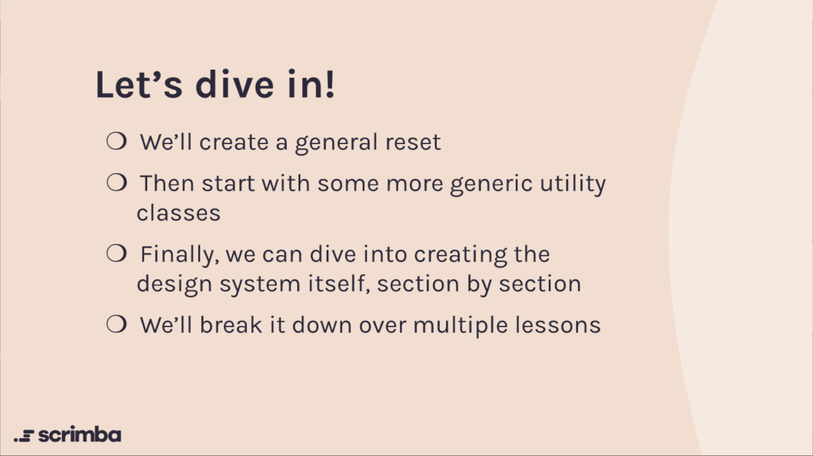
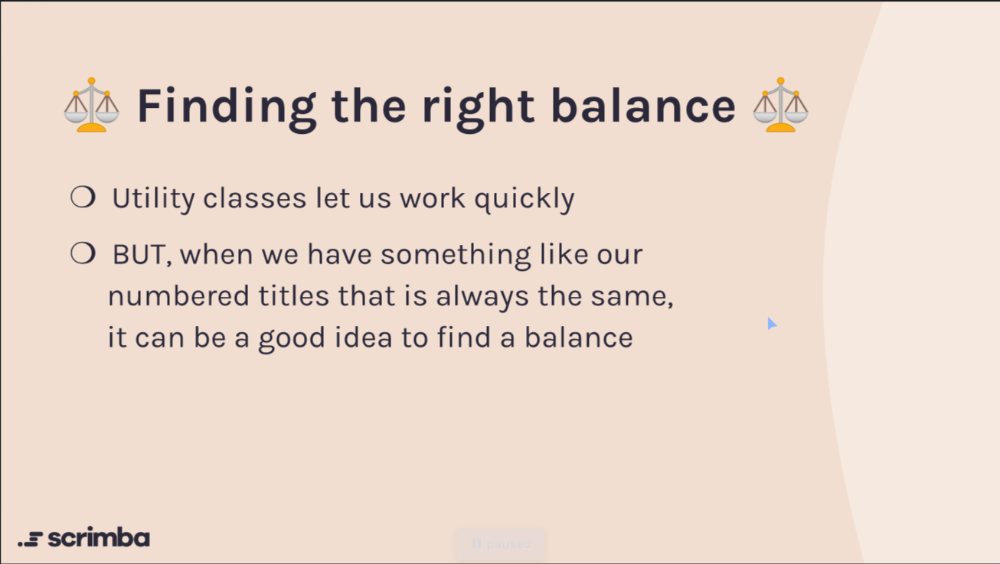
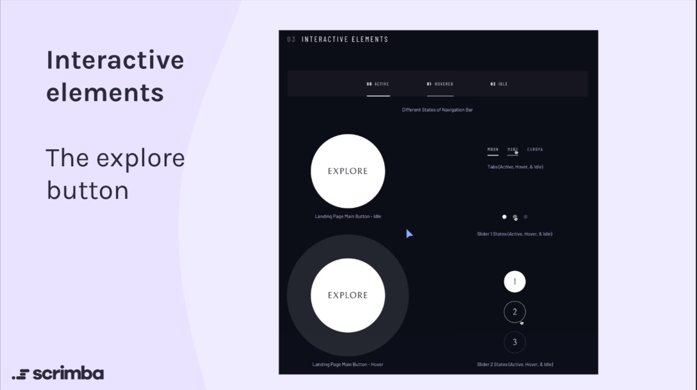

### Some of the main topics
 - CSS Design System
    +  Utility classes and custom properties
 - Flexbox and Grid
 - Accessibility

### The Design System - Space Tourism

Space Tourism

This page gives us an overview of
the styling we will need for our
entire project.

We can create a CSS design system
based on this, instead of styling
things page by page.

How I will approach this

- Custom properties are
- Utility classes will allow us to save time
in the long run
- Don't stress too much on the layout
- We won't have everything we need, but
we'll be off to a running start

